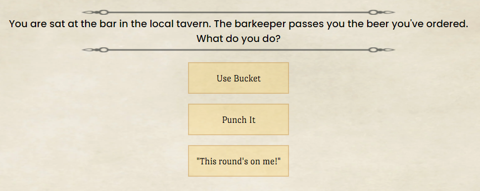

# Adventurers Driving Licence

A short multiple choice RPG adventure simulating a tongue-in-cheek "driving test" for budding stereotypical role play adventurers. 
The player is one of these budding adventurers and is "tested" and awarded their specific licence based on their choices.

**The live project is available on GitHub Pages: [Adventurers Driving Licence](https://llewelyn-williams.github.io/adventurers-driving-licence/)**

## Table of Contents
- [Features](#features)
  * [Current Features](#current-features)
  * [Future Features](#future-features)
- [User Experience Design](#user-experience-design)
  * [Strategy](#strategy)
  * [Scope](#scope)
    + [User Stories](#user-stories)
  * [Structure](#structure)
  * [Skeleton](#skeleton)
    + [Navigation Tree](#navigation-tree)
    + [Wireframes](#wireframes)
  * [Surface](#surface)
- [Technologies Used](#technologies-used)
  * [Languages](#languages)
  * [Libraries](#libraries)
  * [APIs](#apis)
  * [Other Services and Software](#other-services-and-software)
- [Testing](#testing)
- [Deployment Instructions](#deployment-instructions)
- [Acknowledgements](#acknowledgements)
  * [Content](#content)
  * [Media](#media)
  * [Thanks](#thanks)

## Features

Take your adventurers driving licence test and be awarded your specific licence dependent on your test results. Retake the test and earn more licences until you collect all 6. Adjust the music and sound effects from the options menu to your liking.

### Current Features
These features have been implemented in the project.

 - Multiple Choice Adventurer Test
	 * Choose from three different options.
	 * Selected options expand with a sound effect to reveal more descriptive text.
	 

 - Earn Your Adventurer Licence
	 * Your licence received is determined by the choices you make.
	 * Continue playing to collect more licences.
	 

 - Configurable Audio and Save Management
	 * Turn the music and sound effects on or off and adjust their volume independently.
	 * Delete all the licences you have earned so far and start over.
	 

 - Collect and view licences.
	 * Specific area to view your licences collection.
	 * Collect 6 in total.
	 

### Future Features
Possible features to be considered for future releases.
 - Feature 1
	 * Bullet Point 1
	 * Bullet Point 2

 - Feature 2
	 * Bullet Point 1
	 * Bullet Point 2

## User Experience Design

### Strategy

The game intended to be an amusing distraction. With the premise being based on personality quizzes but framed as a spoof-like fantasy game it should appeal to anyone who has some familiarity with fantasy games.

Users will expect interactive elements to be obvious in their purpose and respond in an expected way when used. Ultimately through the use of the interactive elements users should see changes that are based on their specific interactions. While due to the personality quiz like convention, results might be precisely as expected but any amount of unexpected result should form part of the amusement.

### Scope

For a user to want to interact with the game it should meet the following:
 - Be quick loading
 - Intuitive
 - Provide immediate feedback
 - Be visually clear and well laid out
 - Give the user a reason to continue playing

The target is a game that continually makes the next move for the player obvious, allows them, always provides feedback when they interact and can be accessed via different devices (mobile, tablet, PC).

#### User Stories

| Scenario | Requirements  |
|----------|---------------|
| **As a player**, I want to be able to jump right in and start playing right away. | The game mechanics should be based on previously well understood conventions or fully explained in clear language when something new is introduced. |
| I want to feel confident that my input is being received accurately. | A combination of forms of feedback should be presented when input is received to make it very clear what the user is submitting.|
| I want to be able to have some control over non fundamental game elements such as background music. | A settings section within the menu to allow the user to control these types of elements. |
| **As a returning player**, I want to be able to pick up where I left off. | The capability to save progress. Either manually or automatically.|
| I want to be able to refresh myself on any parts of the game I might’ve forgotten about. | Provide a guide from within the menu.|
| **As player who has completed the game** , I want to see a record of what I have achieved. | A different display to indicate completion and a record of what has been achieved is accessible from within the menu. |

### Structure

Three main content areas can provide the functions required.
1. The game area, where images and text are displayed along with interactive elements and access to menus
2. A menu area where settings can be accessed
3. A credits area, where attribution can be provided from within the game itself.

### Skeleton

#### Navigation Tree

#### Wireframes

Wireframes showing layout plans for different devices.

The complete set of wireframes can be viewed via these images:
 - [Mobile Wireframes](assets/wireframes/mobile-wireframes.png)
 - [Tablet Wireframes](assets/wireframes/tablet-wireframes.png)
 - [Desktop Wireframes](assets/wireframes/desktop-wireframes.png)

### Surface

Design choices are reminiscent of the medieval tavern theme often found in fantasy settings, mixed with older (90s) RPG videogame aesthetics. 

## Technologies Used
### Languages
 - HTML 
 - CSS
 - JavaScript

### Libraries
 - [jQuery](https://jquery.com/)

 ### APIs
 - [Twemoji](https://github.com/twitter/twemoji#api)
 
### Other Services and Software
 - Git
 	 - Version control.
 - GitHub
 	 - Cloud-based storage and deployment via GitHub Pages.
 - GitPod
 	 - IDE.
 - [StackEdit](https://stackedit.io)
	 - Used to assist in the planning and creation of this README markdown file.
 - [markdown-toc](https://ecotrust-canada.github.io/markdown-toc)
	 - Used to generate table of contents in markdown for this README markdown file.
 - [miro](https://miro.com/)
	 - For the creation of [sitemap](#navigation-tree) and [wireframes](#wireframes).
 - [Gimp](https://www.gimp.org/)
	 - Editing, cropping, scaling of site images
 - [Dynamic Dummy Image Generator](https://dummyimage.com/)
	 - To provide placeholder images during development
 - [favicon.io](https://favicon.io/emoji-favicons/martial-arts-uniform)
	 - To generate favicon.ico
 - [JSON Formatter - JSON Editor](https://jsonformatter.org/json-editor)
	 - To help generate JSON structure
 - [TinyPNG](https://tinypng.com/)
	 - For quick and easy image optimisation.
	 

## Testing

See separate [TESTING.md](TESTING.md)

## Deployment Instructions

Deployment via GitHubPages

 1. Navigate to GitHub Repository
 2. Use the **Settings** link (cog icon) from the menu atop the repository.
 3. Use the **Pages** link from the left hand navigation menu.
 4. Select **Branch: master** as the source.
 5. Click **Save**
 6. The site can be found at the address `https://`**github-username**`.github.io/`**repository-name**

## Acknowledgements

### Content

Reused or inspired code from the following sources:
 - [StackOverflow Questions & Answers](https://stackoverflow.com/questions/) various, links to specifics in code.
 - [Medium](https://medium.com/) linked to specific in code.

 Used for referencing:
 - [MDN Web Docs](https://developer.mozilla.org/en-US/)
 - [W3 Schools](https://www.w3schools.com/)

### Media

 - [Interaction With Magic Gem](https://www.gamedevmarket.net/asset/rpg-fantasy-game-interface-sounds/) by [Potion Audio](https://www.gamedevmarket.net/member/potion-audio/)
 used as award-noise.
 - [UI Buy Button 04](https://www.gamedevmarket.net/asset/rpg-fantasy-game-interface-sounds/) by [Potion Audio](https://www.gamedevmarket.net/member/potion-audio/)
 used as test starting sound effect.
 - [Crumpling Paper](https://freesound.org/people/quantumriver/sounds/552152/) by [quantumriver](https://freesound.org/people/quantumriver/)
 used as sound on delete button.
 - [PaperPage1.wav](https://freesound.org/people/mateusboga/sounds/219022/) by [mateusboga](https://freesound.org/people/mateusboga/)
 used as box expansion sound effect.
 - [flipCard.wav](https://freesound.org/people/Splashdust/sounds/84322/) by [Splashdust](https://freesound.org/people/Splashdust/)
 used as test progression sound effect.
 - [Enchanted Valley](https://incompetech.com/music/royalty-free/mp3-royaltyfree/Enchanted%20Valley.mp3) by [Kevin MacLeod](https://incompetech.com/music/royalty-free/music.html)
 used as background music.
 - [Flourish](https://www.vecteezy.com/vector-art/330172-flourishes-calligraphic-ornaments-and-frames) by [Lia-Aramburu](https://www.vecteezy.com/members/lia-aramburu) via [Vecteezy](https://www.vecteezy.com/free-vector/ornaments)
 used as a flourish around the scenarios.
 - [Brown Ice](https://www.deviantart.com/darkwood67/art/brown-ice-136812258) by [darkwood67](https://www.deviantart.com/darkwood67)
 used as the background image.
 - Mockups Screenshot from [Am I Responsive](http://ami.responsivedesign.is/)
 - Emoji used for favicon.ico and throughout is part of [Twemoji](https://twemoji.twitter.com/)

### Thanks

 - Code Institute
 - My Code Institute Mentor
 - My Long Suffering Partner